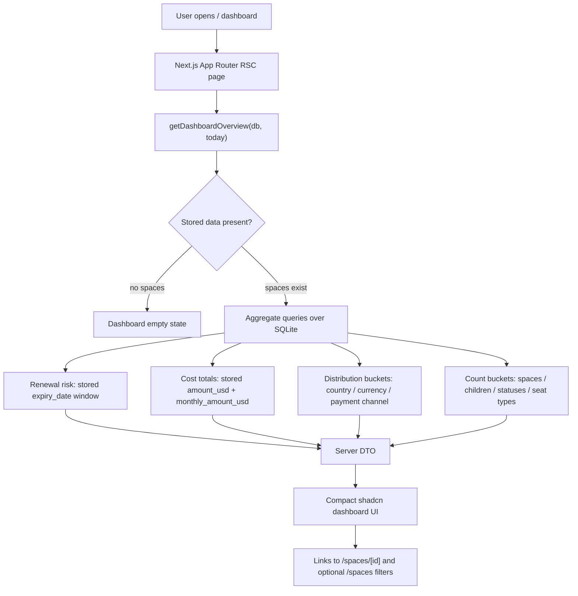

# Phase 05: Dashboard & Overview - Research

**Researched:** 2026-06-30
**Domain:** Next.js App Router dashboard aggregation over SQLite/Drizzle stored derived fields
**Confidence:** HIGH

<user_constraints>
## User Constraints (from CONTEXT.md)

Source for this entire section: [VERIFIED: .planning/phases/05-dashboard-overview/05-CONTEXT.md]

### Locked Decisions

## Implementation Decisions

### Dashboard Priority and First Screen
- **D-01:** Use a core-value-first dashboard. The first screen must make renewal risk and total USD spend visible together, not bury either behind secondary analysis.
- **D-02:** Use a compact operations-dashboard layout rather than a spacious marketing-style overview. This is a repeated-use internal tool, so the page should optimize for scanning.
- **D-03:** The top area should present four key metrics in this order: expired/soon-to-expire spaces, total USD spend, total spaces, and total child accounts.
- **D-04:** Immediately after the top metrics, show the expiring-space list. Distribution summaries and count details follow after the actionable renewal list.
- **D-05:** The dashboard is view-first. It may link to existing space detail/edit flows, but Phase 5 does not need new dashboard-specific mutation workflows.

### the agent's Discretion
- Exact card sizing, responsive grid breakpoints, and chart/table composition are planner discretion, but must preserve the compact operations-dashboard priority above.
- Metric semantics that were not explicitly discussed should follow existing project semantics: frozen USD amounts are authoritative, historical rows are not recomputed from live FX, and money math must use integer minor units and decimal-string rates.
- Alert threshold details may reuse the existing `expiryStatus` behavior unless planning finds a stronger project-consistent reason to adjust it.

### Deferred Ideas (OUT OF SCOPE)

## Deferred Ideas

- Metric-semantics details and alert-behavior edge cases were not deeply discussed. Planner may choose conservative defaults from existing code and prior decisions.
- External notifications remain deferred to v2 requirements.
</user_constraints>

## Summary

Phase 05 should be planned as a read-only Server Component dashboard at `/`, replacing the current placeholder in `src/app/page.tsx`. [VERIFIED: src/app/page.tsx] The data source should be a new explicit-db dashboard query module near `src/db/spaces.ts` and `src/db/childAccounts.ts`, because existing DB helpers already use explicit `db` parameters for production/test reuse. [VERIFIED: src/db/spaces.ts] [VERIFIED: src/db/childAccounts.ts]

The key planning risk is double counting. [VERIFIED: src/db/schema.ts] Space payment USD lives on `space.amountUsd`, while child monthly USD lives on `childAccount.monthlyAmountUsd`; summing `space.amountUsd` through a child-account join would multiply each space payment by its child count. [VERIFIED: src/db/schema.ts] Plan separate aggregate queries for space payments and child monthly costs, merge buckets in TypeScript using integer USD minor units, and assert that subtotals reconcile exactly to the grand total. [VERIFIED: src/lib/money.ts] [CITED: https://orm.drizzle.team/docs/select#aggregations]

No new package should be installed for this phase. [VERIFIED: .planning/phases/05-dashboard-overview/05-UI-SPEC.md] The approved UI contract explicitly uses existing shadcn/Radix primitives and CSS bar lists instead of a chart package. [VERIFIED: .planning/phases/05-dashboard-overview/05-UI-SPEC.md] The root dashboard must be dynamic/Node-backed when it imports `@/db`, matching existing DB-backed pages that export `dynamic = "force-dynamic"`. [VERIFIED: src/app/spaces/page.tsx] [CITED: https://nextjs.org/docs/app/api-reference/file-conventions/route-segment-config]

**Primary recommendation:** Build one `getDashboardOverview(db, today?)` query facade that returns pre-aggregated DTOs for metrics, expiring rows, spend buckets, and count buckets; render those DTOs from `src/app/page.tsx` with existing shadcn primitives and no dashboard mutations. [VERIFIED: .planning/phases/05-dashboard-overview/05-CONTEXT.md] [VERIFIED: .planning/phases/05-dashboard-overview/05-UI-SPEC.md]

<phase_requirements>
## Phase Requirements

| ID | Description | Research Support |
|----|-------------|------------------|
| DASH-01 | 仪表盘高亮显示即将到期 / 已过期的空间 | Use stored `space.expiryDate`, existing 7-day `expiryStatus`, `ExpiryBadge`, and an expiring-only list ordered expired first then soon by date. [VERIFIED: .planning/REQUIREMENTS.md] [VERIFIED: src/lib/expiry.ts] [VERIFIED: src/components/spaces/expiry-badge.tsx] |
| DASH-02 | 仪表盘显示总支出(按 USD 折算) | Sum stored `space.amountUsd` plus stored `childAccount.monthlyAmountUsd` as integer USD minor units; do not recompute from FX rates. [VERIFIED: .planning/REQUIREMENTS.md] [VERIFIED: src/db/schema.ts] [VERIFIED: .planning/STATE.md] |
| DASH-03 | 仪表盘显示按国家 / 币种 / 支付渠道的支出分布 | Build country/channel buckets from parent space attribution and currency buckets from each cost row's own currency; merge space and child subtotal maps so bucket totals reconcile to the grand total. [VERIFIED: .planning/REQUIREMENTS.md] [VERIFIED: src/db/schema.ts] |
| DASH-04 | 仪表盘显示空间数、子账号数等数量统计 | Count `space` rows, `child_account` rows, renewal statuses, and child rows by `seatType` using aggregate queries and stored rows. [VERIFIED: .planning/REQUIREMENTS.md] [VERIFIED: src/db/schema.ts] |
</phase_requirements>

## Project Constraints

| Constraint | Planning Implication |
|------------|----------------------|
| The project is a single-user web app with no complex login/permission system. [VERIFIED: .claude/CLAUDE.md] | Do not add auth, roles, or per-operator dashboards in Phase 05. [VERIFIED: .planning/phases/05-dashboard-overview/05-CONTEXT.md] |
| Base currency is fixed to USD and historical USD values are frozen at save time. [VERIFIED: .claude/CLAUDE.md] [VERIFIED: .planning/STATE.md] | Dashboard totals use stored USD minor-unit columns only; no live FX recomputation. [VERIFIED: src/db/schema.ts] |
| The app must not store child account passwords or sensitive credentials. [VERIFIED: .claude/CLAUDE.md] | Dashboard may display email/login identifiers already stored, but must not introduce credential fields or secret-like columns. [VERIFIED: src/components/spaces/child-account-table.tsx] |
| Server Components read data and Server Actions mutate data in the established pattern. [VERIFIED: .planning/phases/05-dashboard-overview/05-CONTEXT.md] | Keep the dashboard read-only and server-rendered; no new dashboard Server Actions. [VERIFIED: .planning/phases/05-dashboard-overview/05-UI-SPEC.md] |
| `better-sqlite3` is a native Node module and existing DB-backed pages are dynamic RSC pages. [VERIFIED: src/db/index.ts] [VERIFIED: src/app/spaces/page.tsx] | Export `dynamic = "force-dynamic"` from the dashboard page once it imports `@/db`; do not target Edge runtime. [CITED: https://nextjs.org/docs/app/api-reference/file-conventions/route-segment-config] |
| Existing UI uses compact shadcn/Radix operational screens, not marketing pages. [VERIFIED: .planning/phases/05-dashboard-overview/05-UI-SPEC.md] | Use dense metric cards, tables, badges, and CSS bars; keep the expiring list above distribution analysis. [VERIFIED: .planning/phases/05-dashboard-overview/05-UI-SPEC.md] |
| User-provided AGENTS instruction requires checking `tool_search` before concluding subagent availability. [VERIFIED: user prompt] | `tool_search` found no `spawn_agent`, `subagent`, or `multi-agent` tools, so this research was completed inline. [VERIFIED: tool_search] |
| No project skill directories were found under `.claude/skills/` or `.agents/skills/`. [VERIFIED: shell `Get-ChildItem .claude,.agents`] | No project-specific skill rules need to be added to the Phase 05 plan. [VERIFIED: shell `Get-ChildItem .claude,.agents`] |

## Architectural Responsibility Map

| Capability | Primary Tier | Secondary Tier | Rationale |
|------------|--------------|----------------|-----------|
| Dashboard route and page shell | Frontend Server (RSC) | Browser / Client | `/` is an App Router page and existing DB-backed pages read SQLite in Server Components. [VERIFIED: src/app/page.tsx] [VERIFIED: src/app/spaces/page.tsx] |
| Renewal-risk filtering and ordering | Database / Storage | Frontend Server (RSC) | Filter/order over stored `expiryDate`; use server-side date window inputs so the browser does not own business classification. [VERIFIED: src/db/schema.ts] [VERIFIED: src/lib/expiry.ts] |
| USD grand total and subtotals | Database / Storage | Frontend Server (RSC) | Aggregate stored integer USD minor units in SQLite and reconcile in server DTOs before rendering. [VERIFIED: src/db/schema.ts] [CITED: https://orm.drizzle.team/docs/select#aggregations] |
| Spend distribution buckets | Database / Storage | Frontend Server (RSC) | Use group-by aggregates for country/currency/payment-channel buckets, then merge independent cost classes without double counting. [VERIFIED: src/db/schema.ts] [CITED: https://orm.drizzle.team/docs/select#aggregations] |
| Count overviews | Database / Storage | Frontend Server (RSC) | Space, child-account, status, and seat-type counts are aggregate read concerns over persisted rows. [VERIFIED: src/db/schema.ts] |
| Dashboard interaction | Browser / Client | Frontend Server (RSC) | Only links, anchors, tooltips, horizontal table overflow, and existing detail navigation are needed; no dashboard mutation workflow. [VERIFIED: .planning/phases/05-dashboard-overview/05-UI-SPEC.md] |

## Standard Stack

### Core

| Library | Version | Purpose | Why Standard |
|---------|---------|---------|--------------|
| `next` [WARNING: existing dependency flagged SUS by package-legitimacy because latest publish is recent; do not install/upgrade in this phase.] | installed `16.2.9`, registry latest `16.2.9`, modified 2026-06-29 [VERIFIED: package.json + npm view] | App Router page at `/`, RSC rendering, route segment config. [VERIFIED: src/app/page.tsx] [CITED: https://nextjs.org/docs/app/api-reference/file-conventions/route-segment-config] | Existing app framework and already used by all routes. [VERIFIED: package.json] |
| `drizzle-orm` [VERIFIED: npm registry] | installed `0.45.2`, registry latest `0.45.2`, modified 2026-06-27 [VERIFIED: package.json + npm view] | Typed SQLite selects, joins, `groupBy`, `count`, `sum`, and raw typed SQL fragments. [CITED: https://orm.drizzle.team/docs/select#aggregations] | Existing DB access layer uses Drizzle helpers with explicit `db` parameters. [VERIFIED: src/db/spaces.ts] |
| `better-sqlite3` [WARNING: existing dependency flagged SUS by package-legitimacy because latest publish is recent; do not install/upgrade in this phase.] | installed `12.11.1`, registry latest `12.11.1`, modified 2026-06-15 [VERIFIED: package.json + npm view] | Local SQLite database driver. [VERIFIED: src/db/index.ts] | Existing singleton DB and test harness both use it. [VERIFIED: src/db/index.ts] [VERIFIED: src/test/db-harness.ts] |
| `date-fns` [VERIFIED: npm registry] | installed `4.4.0`, registry latest `4.4.0`, modified 2026-05-29 [VERIFIED: package.json + npm view] | Date-window calculations and `differenceInCalendarDays`. [VERIFIED: node_modules/date-fns/differenceInCalendarDays.d.ts] | Existing expiry helper already uses it for calendar-day status. [VERIFIED: src/lib/expiry.ts] |
| Existing shadcn/Radix UI primitives via `radix-ui` and vendored `src/components/ui/*` [WARNING: `radix-ui` existing dependency flagged SUS by package-legitimacy because latest publish is recent; do not install/upgrade in this phase.] | `radix-ui` installed `1.6.0`, registry latest `1.6.0`, modified 2026-06-30 [VERIFIED: package.json + npm view] | Cards, tables, badges, buttons, tooltips, skeletons, separators. [VERIFIED: src/components/ui] [CITED: https://ui.shadcn.com/docs/components/card] [CITED: https://ui.shadcn.com/docs/components/table] | Approved Phase 05 UI contract restricts the phase to existing vendored primitives. [VERIFIED: .planning/phases/05-dashboard-overview/05-UI-SPEC.md] |

### Supporting

| Library | Version | Purpose | When to Use |
|---------|---------|---------|-------------|
| `lucide-react` [WARNING: existing dependency flagged SUS by package-legitimacy because latest publish is recent; do not install/upgrade in this phase.] | installed `1.21.0`, registry latest `1.22.0`, modified 2026-06-28 [VERIFIED: package.json + npm view] | Existing icon library for detail links and dashboard affordances. [VERIFIED: components.json] | Use only existing icons such as `Eye`; do not add a new icon set. [VERIFIED: src/components/spaces/space-table.tsx] |
| `zod` [VERIFIED: npm registry] | installed `4.4.3`, registry latest `4.4.3`, modified 2026-05-04 [VERIFIED: package.json + npm view] | Existing validation layer. [VERIFIED: package.json] | No new dashboard input schema is expected; only use if a typed filter/search param is introduced. [VERIFIED: .planning/phases/05-dashboard-overview/05-UI-SPEC.md] |
| `vitest` [WARNING: existing dependency flagged SUS by package-legitimacy because latest publish is recent; do not install/upgrade in this phase.] | installed `4.1.9`, registry latest `4.1.9`, modified 2026-06-15 [VERIFIED: package.json + npm view] | Unit/query test runner. [VERIFIED: vitest.config.ts] | Add `src/db/dashboard.query.test.ts`; run with `npm test`, not Jest flags. [VERIFIED: npm test] |

### Alternatives Considered

| Instead of | Could Use | Tradeoff |
|------------|-----------|----------|
| Existing shadcn cards/tables/CSS bars [VERIFIED: .planning/phases/05-dashboard-overview/05-UI-SPEC.md] | Recharts or another chart package [ASSUMED] | Rejected for this phase because the UI contract explicitly says no new chart package and CSS bars are enough for distribution summaries. [VERIFIED: .planning/phases/05-dashboard-overview/05-UI-SPEC.md] |
| RSC direct DB reads [VERIFIED: src/app/spaces/page.tsx] | Client fetch/TanStack Query [ASSUMED] | Rejected because dashboard is read-first, server-rendered, and has no client mutation workflow. [VERIFIED: .planning/phases/05-dashboard-overview/05-CONTEXT.md] |
| Drizzle aggregate builders [CITED: https://orm.drizzle.team/docs/select#aggregations] | String-built SQL [ASSUMED] | Rejected because existing project patterns use Drizzle parameterized builders and avoid SQL string concatenation. [VERIFIED: src/db/channels.ts] [VERIFIED: src/db/fxRates.ts] |

**Installation:**

```bash
# No install. Phase 05 uses existing dependencies only.
```

**Version verification:** Versions above were checked with `npm view` on 2026-06-30. [VERIFIED: npm view]

## Package Legitimacy Audit

No new external packages should be installed in Phase 05. [VERIFIED: .planning/phases/05-dashboard-overview/05-UI-SPEC.md] Existing packages were audited because the planner will reference them. [VERIFIED: package-legitimacy seam]

| Package | Registry | Latest Publish / Downloads | Source Repo | Verdict | Disposition |
|---------|----------|----------------------------|-------------|---------|-------------|
| `next` | npm | 2026-06-09 / 39,590,260 weekly [VERIFIED: package-legitimacy seam] | github.com/vercel/next.js [VERIFIED: package-legitimacy seam] | SUS: too-new [VERIFIED: package-legitimacy seam] | Existing only; no install/upgrade task. |
| `react` | npm | 2026-06-01 / 146,247,311 weekly [VERIFIED: package-legitimacy seam] | github.com/facebook/react [VERIFIED: package-legitimacy seam] | SUS: too-new [VERIFIED: package-legitimacy seam] | Existing only; no install/upgrade task. |
| `react-dom` | npm | 2026-06-01 / 137,950,070 weekly [VERIFIED: package-legitimacy seam] | github.com/facebook/react [VERIFIED: package-legitimacy seam] | SUS: too-new [VERIFIED: package-legitimacy seam] | Existing only; no install/upgrade task. |
| `drizzle-orm` | npm | 2026-03-27 / 11,333,091 weekly [VERIFIED: package-legitimacy seam] | github.com/drizzle-team/drizzle-orm [VERIFIED: package-legitimacy seam] | OK [VERIFIED: package-legitimacy seam] | Approved existing dependency. |
| `better-sqlite3` | npm | 2026-06-15 / 7,261,963 weekly [VERIFIED: package-legitimacy seam] | github.com/WiseLibs/better-sqlite3 [VERIFIED: package-legitimacy seam] | SUS: too-new [VERIFIED: package-legitimacy seam] | Existing only; no install/upgrade task. |
| `date-fns` | npm | 2026-05-29 / 91,162,216 weekly [VERIFIED: package-legitimacy seam] | github.com/date-fns/date-fns [VERIFIED: package-legitimacy seam] | OK [VERIFIED: package-legitimacy seam] | Approved existing dependency. |
| `lucide-react` | npm | 2026-06-28 / 83,762,574 weekly [VERIFIED: package-legitimacy seam] | github.com/lucide-icons/lucide [VERIFIED: package-legitimacy seam] | SUS: too-new [VERIFIED: package-legitimacy seam] | Existing only; no install/upgrade task. |
| `radix-ui` | npm | 2026-06-15 / 9,050,477 weekly [VERIFIED: package-legitimacy seam] | github.com/radix-ui/primitives [VERIFIED: package-legitimacy seam] | SUS: too-new [VERIFIED: package-legitimacy seam] | Existing only; no install/upgrade task. |
| `zod` | npm | 2026-05-04 / 209,687,743 weekly [VERIFIED: package-legitimacy seam] | github.com/colinhacks/zod [VERIFIED: package-legitimacy seam] | OK [VERIFIED: package-legitimacy seam] | Approved existing dependency. |
| `vitest` | npm | 2026-06-15 / 68,928,372 weekly [VERIFIED: package-legitimacy seam] | github.com/vitest-dev/vitest [VERIFIED: package-legitimacy seam] | SUS: too-new [VERIFIED: package-legitimacy seam] | Existing only; no install/upgrade task. |
| `shadcn` | npm | 2026-06-26 / 4,756,583 weekly [VERIFIED: package-legitimacy seam] | github.com/shadcn-ui/ui [VERIFIED: package-legitimacy seam] | SUS: too-new [VERIFIED: package-legitimacy seam] | Existing CLI only; no install/upgrade task. |

Postinstall probe result: all audited packages returned no `scripts.postinstall`. [VERIFIED: npm view scripts.postinstall]

**Packages removed due to [SLOP] verdict:** none. [VERIFIED: package-legitimacy seam]
**Packages flagged as suspicious [SUS]:** existing `next`, `react`, `react-dom`, `better-sqlite3`, `lucide-react`, `radix-ui`, `vitest`, and `shadcn` only; if a plan proposes installing or upgrading any of them, insert `checkpoint:human-verify` first. [VERIFIED: package-legitimacy seam]

## Architecture Patterns

### System Architecture Diagram



### Recommended Project Structure

```text
src/
├── app/
│   └── page.tsx                         # Replace placeholder root dashboard. [VERIFIED: src/app/page.tsx]
├── components/
│   └── dashboard/
│       ├── metric-card.tsx              # Compact metric display using existing Card. [VERIFIED: src/components/ui/card.tsx]
│       ├── expiring-space-table.tsx     # Read-only risk table using existing Table and ExpiryBadge. [VERIFIED: src/components/spaces/expiry-badge.tsx]
│       └── distribution-list.tsx        # CSS bar-list, no chart dependency. [VERIFIED: 05-UI-SPEC.md]
└── db/
    ├── dashboard.ts                     # Explicit-db aggregate facade. [VERIFIED: src/db/spaces.ts]
    └── dashboard.query.test.ts          # Vitest coverage for DASH-01..04. [VERIFIED: vitest.config.ts]
```

### Pattern 1: Single Dashboard Query Facade

**What:** Expose one `getDashboardOverview(db, today = new Date())` function that returns all dashboard DTOs. [VERIFIED: src/db/spaces.ts]
**When to use:** Use for the root dashboard page and tests so aggregation semantics are centralized. [VERIFIED: src/test/db-harness.ts]
**Example:**

```typescript
// Source: existing explicit-db pattern in src/db/spaces.ts and Drizzle aggregate docs.
// [VERIFIED: src/db/spaces.ts] [CITED: https://orm.drizzle.team/docs/select#aggregations]
export type DashboardOverview = {
  totals: {
    renewalRiskSpaces: number;
    totalUsdMinor: number;
    spacePaymentUsdMinor: number;
    childMonthlyUsdMinor: number;
    totalSpaces: number;
    totalChildAccounts: number;
  };
  expiringSpaces: DashboardExpiringSpace[];
  distributions: {
    byCountry: DashboardBucket[];
    byCurrency: DashboardBucket[];
    byPaymentChannel: DashboardBucket[];
  };
  counts: DashboardCounts;
};

export function getDashboardOverview(db: Db, today = new Date()): DashboardOverview {
  // Run independent aggregate queries, then merge into one DTO.
}
```

### Pattern 2: Independent Cost-Class Aggregates

**What:** Sum space payments and child monthly prices separately, then add integer USD minor-unit subtotals. [VERIFIED: src/db/schema.ts]
**When to use:** Use for totals and all distribution buckets to prevent parent-row multiplication through child joins. [VERIFIED: src/db/schema.ts]
**Example:**

```typescript
// Source: Drizzle aggregate docs + schema columns.
// [CITED: https://orm.drizzle.team/docs/select#aggregations] [VERIFIED: src/db/schema.ts]
import { sql } from "drizzle-orm";

const spacePayment = db
  .select({
    usdMinor: sql<number>`coalesce(sum(${space.amountUsd}), 0)`,
  })
  .from(space)
  .get();

const childMonthly = db
  .select({
    usdMinor: sql<number>`coalesce(sum(${childAccount.monthlyAmountUsd}), 0)`,
  })
  .from(childAccount)
  .get();

const spacePaymentUsdMinor = spacePayment?.usdMinor ?? 0;
const childMonthlyUsdMinor = childMonthly?.usdMinor ?? 0;
const totalUsdMinor = spacePaymentUsdMinor + childMonthlyUsdMinor;
```

### Pattern 3: Stored Expiry Window, No Expiry Recalculation

**What:** Filter by stored `space.expiryDate` and a server-computed today/soon window; do not recompute `openingDate + period` on the dashboard. [VERIFIED: src/db/schema.ts] [VERIFIED: src/lib/expiry.ts]
**When to use:** Use for renewal-risk metric, expiring list, and status counts. [VERIFIED: .planning/phases/05-dashboard-overview/05-CONTEXT.md]
**Example:**

```typescript
// Source: existing expiry helper threshold + Drizzle select docs.
// [VERIFIED: src/lib/expiry.ts] [CITED: https://orm.drizzle.team/docs/select#filtering]
import { addDays, format } from "date-fns";
import { asc, lte, sql } from "drizzle-orm";

const todayIso = format(today, "yyyy-MM-dd");
const soonIso = format(addDays(today, 7), "yyyy-MM-dd");

const expiringRows = db
  .select({ space, paymentChannel })
  .from(space)
  .innerJoin(paymentChannel, eq(paymentChannel.id, space.paymentChannelId))
  .where(lte(space.expiryDate, soonIso))
  .orderBy(
    sql`case when ${space.expiryDate} < ${todayIso} then 0 else 1 end`,
    asc(space.expiryDate),
  )
  .all();
```

### Pattern 4: Distribution Buckets Reconcile by Construction

**What:** Represent every distribution bucket as `{ key, label, usdMinor, percentage }` and compute percentages after the grand total is known. [VERIFIED: .planning/phases/05-dashboard-overview/05-UI-SPEC.md]
**When to use:** Use for country, currency, and payment-channel distribution cards. [VERIFIED: .planning/REQUIREMENTS.md]
**Example:**

```typescript
// Source: money integer-minor-unit model and UI reconciliation copy rules.
// [VERIFIED: src/lib/money.ts] [VERIFIED: .planning/phases/05-dashboard-overview/05-UI-SPEC.md]
function toBuckets(rows: Array<{ key: string; label: string; usdMinor: number }>, grandTotal: number) {
  return rows.map((row) => ({
    ...row,
    percentage: grandTotal === 0 ? 0 : (row.usdMinor / grandTotal) * 100,
  }));
}

function assertReconciles(rows: Array<{ usdMinor: number }>, expected: number) {
  const actual = rows.reduce((sum, row) => sum + row.usdMinor, 0);
  if (actual !== expected) {
    throw new Error(`dashboard bucket total mismatch: ${actual} !== ${expected}`);
  }
}
```

### Anti-Patterns to Avoid

- **Joined parent-child sum:** Do not sum `space.amountUsd` in a `space` to `child_account` join, because one parent payment will repeat once per child row. [VERIFIED: src/db/schema.ts]
- **Live FX recomputation:** Do not derive dashboard USD totals from `amountMinor * rateUsed` or current `fx_rate`; use frozen USD fields. [VERIFIED: .planning/STATE.md] [VERIFIED: src/db/schema.ts]
- **Dashboard mutation actions:** Do not add edit/delete controls to the dashboard; link to existing space detail/list flows. [VERIFIED: .planning/phases/05-dashboard-overview/05-UI-SPEC.md]
- **Chart package install:** Do not install Recharts or dashboard block packages for Phase 05; use CSS bars and existing UI primitives. [VERIFIED: .planning/phases/05-dashboard-overview/05-UI-SPEC.md]
- **Fake loading zeros:** Do not render zero metric cards as loading placeholders; server-render real values or use existing skeletons. [VERIFIED: .planning/phases/05-dashboard-overview/05-UI-SPEC.md]

## Don't Hand-Roll

| Problem | Don't Build | Use Instead | Why |
|---------|-------------|-------------|-----|
| Money formatting | Custom decimal/string formatting | `formatMinor` and `formatCurrencyMinor` [VERIFIED: src/lib/money.ts] [VERIFIED: src/lib/currencies.ts] | Existing helpers enforce integer minor units and currency exponents. [VERIFIED: src/lib/money.ts] |
| Expiry badge styling | New status badge palette | `ExpiryBadge` [VERIFIED: src/components/spaces/expiry-badge.tsx] | Existing component encodes expired/soon/normal display. [VERIFIED: src/components/spaces/expiry-badge.tsx] |
| SQL string concatenation | Interpolated raw SQL strings from input | Drizzle builders, `sql<number>`, `count`, `sum`, `groupBy` [CITED: https://orm.drizzle.team/docs/select#aggregations] | Existing DB modules use parameterized builders and explicit DB handles. [VERIFIED: src/db/channels.ts] |
| Dashboard charts | New chart engine or registry block | CSS bars inside shadcn cards [VERIFIED: .planning/phases/05-dashboard-overview/05-UI-SPEC.md] | UI contract bans new chart packages for this phase. [VERIFIED: .planning/phases/05-dashboard-overview/05-UI-SPEC.md] |
| Data fetching layer | REST endpoint + client fetch cache | RSC direct DB query [VERIFIED: src/app/spaces/page.tsx] | Existing read pages query SQLite server-side. [VERIFIED: src/app/spaces/page.tsx] |

**Key insight:** The hard part is not drawing the dashboard; it is preserving accounting semantics by aggregating stored frozen fields exactly once. [VERIFIED: .planning/STATE.md] [VERIFIED: src/db/schema.ts]

## Common Pitfalls

### Pitfall 1: Double Counting Space Payments

**What goes wrong:** The total spend is inflated when `space.amountUsd` is summed after joining to `child_account`. [VERIFIED: src/db/schema.ts]
**Why it happens:** A parent row appears once per child row in a one-to-many join. [CITED: https://orm.drizzle.team/docs/joins]
**How to avoid:** Aggregate space payments and child monthly costs separately, then merge integer subtotals. [VERIFIED: src/db/schema.ts]
**Warning signs:** `spacePaymentUsdMinor` changes when only child-account count changes. [VERIFIED: src/db/schema.ts]

### Pitfall 2: Recomputing Frozen USD

**What goes wrong:** Dashboard totals drift after rates refresh if code recomputes from live `fx_rate` or `rateUsed`. [VERIFIED: .planning/STATE.md]
**Why it happens:** It violates the Phase 3 frozen snapshot decision. [VERIFIED: .planning/phases/03-spaces-expiry-usd-snapshot/03-CONTEXT.md]
**How to avoid:** Treat `space.amountUsd` and `childAccount.monthlyAmountUsd` as authoritative. [VERIFIED: src/db/schema.ts]
**Warning signs:** Dashboard code imports `getRate`, `ensureFreshRates`, `freezeUsdMinor`, or `convertUsdMinorToCurrencyMinor` for USD totals. [VERIFIED: src/db/fxRates.ts] [VERIFIED: src/lib/money.ts]

### Pitfall 3: Static Root Page After DB Import

**What goes wrong:** The root route may be prerendered incorrectly if the dashboard reads SQLite but stays static. [VERIFIED: npm run build output showed `/` static before dashboard implementation]
**Why it happens:** The current placeholder has no dynamic DB access. [VERIFIED: src/app/page.tsx]
**How to avoid:** Once `src/app/page.tsx` imports `@/db`, export `dynamic = "force-dynamic"` like existing DB-backed routes. [VERIFIED: src/app/spaces/page.tsx] [CITED: https://nextjs.org/docs/app/api-reference/file-conventions/route-segment-config]
**Warning signs:** `next build` route table still shows `○ /` after Phase 05 implementation. [VERIFIED: npm run build]

### Pitfall 4: Inconsistent Date Parsing for Days Remaining

**What goes wrong:** A date-only expiry shifts by one day in some time zones if parsed as UTC. [VERIFIED: src/lib/expiry.ts]
**Why it happens:** The existing helper explicitly splits `YYYY-MM-DD` into local date parts to avoid UTC parsing shifts. [VERIFIED: src/lib/expiry.ts]
**How to avoid:** Reuse or export an expiry-days helper rather than duplicating `new Date("YYYY-MM-DD")` logic. [VERIFIED: src/lib/expiry.ts] [VERIFIED: node_modules/date-fns/differenceInCalendarDays.d.ts]
**Warning signs:** Tests pass in one timezone but days-remaining values are off by one elsewhere. [VERIFIED: src/lib/expiry.test.ts]

### Pitfall 5: Copying Jest Flags into Vitest

**What goes wrong:** `npm run test -- --runInBand` fails with `Unknown option --runInBand`. [VERIFIED: shell command 2026-06-30]
**Why it happens:** `--runInBand` is a Jest flag, not a Vitest 4 flag. [VERIFIED: vitest.config.ts] [VERIFIED: npm test]
**How to avoid:** Use `npm test` for the full suite and `npm test -- src/db/dashboard.query.test.ts` or `npx vitest run src/db/dashboard.query.test.ts` for focused runs. [VERIFIED: package.json] [VERIFIED: npm test]
**Warning signs:** Test command fails before loading any test file. [VERIFIED: shell command 2026-06-30]

## Code Examples

Verified patterns from official/local sources:

### Reconciled Dashboard Totals

```typescript
// Source: Drizzle aggregations and local schema.
// [CITED: https://orm.drizzle.team/docs/select#aggregations] [VERIFIED: src/db/schema.ts]
export function getDashboardTotals(db: Db) {
  const spacePayment = db
    .select({ usdMinor: sql<number>`coalesce(sum(${space.amountUsd}), 0)` })
    .from(space)
    .get();

  const childMonthly = db
    .select({ usdMinor: sql<number>`coalesce(sum(${childAccount.monthlyAmountUsd}), 0)` })
    .from(childAccount)
    .get();

  const spacePaymentUsdMinor = spacePayment?.usdMinor ?? 0;
  const childMonthlyUsdMinor = childMonthly?.usdMinor ?? 0;

  return {
    spacePaymentUsdMinor,
    childMonthlyUsdMinor,
    totalUsdMinor: spacePaymentUsdMinor + childMonthlyUsdMinor,
  };
}
```

### Currency Distribution Without Losing Child Currency

```typescript
// Source: schema distinction between space.currencyCode and childAccount.monthlyCurrencyCode.
// [VERIFIED: src/db/schema.ts]
const spaceCurrencyRows = db
  .select({
    key: space.currencyCode,
    usdMinor: sql<number>`coalesce(sum(${space.amountUsd}), 0)`,
  })
  .from(space)
  .groupBy(space.currencyCode)
  .all();

const childCurrencyRows = db
  .select({
    key: childAccount.monthlyCurrencyCode,
    usdMinor: sql<number>`coalesce(sum(${childAccount.monthlyAmountUsd}), 0)`,
  })
  .from(childAccount)
  .groupBy(childAccount.monthlyCurrencyCode)
  .all();
```

### Root Dashboard Page Boundary

```tsx
// Source: existing DB-backed page pattern.
// [VERIFIED: src/app/spaces/page.tsx] [CITED: https://nextjs.org/docs/app/api-reference/file-conventions/route-segment-config]
import { db } from "@/db";
import { getDashboardOverview } from "@/db/dashboard";

export const dynamic = "force-dynamic";

export default function DashboardPage() {
  const overview = getDashboardOverview(db);
  return <DashboardOverview overview={overview} />;
}
```

## State of the Art

| Old Approach | Current Approach | When Changed | Impact |
|--------------|------------------|--------------|--------|
| Client fetch dashboard with REST endpoint [ASSUMED] | Server Component reads SQLite directly through Drizzle [VERIFIED: src/app/spaces/page.tsx] | Project implementation through Phases 1-4 [VERIFIED: .planning/STATE.md] | Fewer moving parts and no client data cache for a single-user dashboard. [VERIFIED: .claude/CLAUDE.md] |
| Live FX recomputation for totals [ASSUMED] | Frozen USD snapshots stored at save time [VERIFIED: .planning/STATE.md] | Phase 3 [VERIFIED: .planning/phases/03-spaces-expiry-usd-snapshot/03-CONTEXT.md] | Dashboard values remain historically stable after FX refresh. [VERIFIED: src/db/schema.ts] |
| Chart library for every distribution [ASSUMED] | CSS bar lists inside existing shadcn cards [VERIFIED: .planning/phases/05-dashboard-overview/05-UI-SPEC.md] | Phase 05 UI contract [VERIFIED: .planning/phases/05-dashboard-overview/05-UI-SPEC.md] | No new dependency or registry block is needed. [VERIFIED: package.json] |
| Per-row TS recomputation of expiry dates [ASSUMED] | Stored `expiryDate` plus status window filtering [VERIFIED: src/db/schema.ts] | Phase 3 [VERIFIED: .planning/phases/03-spaces-expiry-usd-snapshot/03-CONTEXT.md] | Dashboard aggregates read derived fields without recalculating subscription periods. [VERIFIED: .planning/phases/05-dashboard-overview/05-CONTEXT.md] |

**Deprecated/outdated:**
- Recharts for Phase 05 dashboard distributions is out of scope despite earlier stack research mentioning charts, because the approved UI contract says no chart package for this phase. [VERIFIED: .claude/CLAUDE.md] [VERIFIED: .planning/phases/05-dashboard-overview/05-UI-SPEC.md]
- Jest-style `--runInBand` is not a valid test command in this Vitest project. [VERIFIED: shell command 2026-06-30] [VERIFIED: package.json]

## Assumptions Log

| # | Claim | Section | Risk if Wrong |
|---|-------|---------|---------------|
| A1 | Recharts or another chart package could be used outside this locked UI contract. [ASSUMED] | Alternatives Considered / State of the Art | Low for Phase 05 because the UI spec explicitly rejects new chart packages. [VERIFIED: .planning/phases/05-dashboard-overview/05-UI-SPEC.md] |
| A2 | Client fetch/TanStack Query is a generic alternative for dashboards. [ASSUMED] | Alternatives Considered / State of the Art | Low for Phase 05 because local routes already use RSC direct DB reads. [VERIFIED: src/app/spaces/page.tsx] |
| A3 | String-built SQL is a generic alternative to Drizzle builders. [ASSUMED] | Alternatives Considered | Low for Phase 05 because project DB modules use Drizzle builders. [VERIFIED: src/db/channels.ts] |

## Open Questions

1. **None blocking.** [VERIFIED: .planning/phases/05-dashboard-overview/05-CONTEXT.md]
   - What we know: Phase 05 context and UI spec define metric order, expiring-list priority, cost subtotals, no live FX recomputation, and no new chart package. [VERIFIED: .planning/phases/05-dashboard-overview/05-CONTEXT.md] [VERIFIED: .planning/phases/05-dashboard-overview/05-UI-SPEC.md]
   - What's unclear: No implementation blocker remains for planning. [VERIFIED: local source inspection]
   - Recommendation: Plan implementation directly with query tests first. [VERIFIED: vitest.config.ts]

## Environment Availability

| Dependency | Required By | Available | Version | Fallback |
|------------|-------------|-----------|---------|----------|
| Node.js | Next.js/Vitest/build runtime | yes [VERIFIED: `node --version`] | `v25.5.0` [VERIFIED: `node --version`] | None needed. |
| npm / npx | scripts and registry probes | yes [VERIFIED: `npm --version`] | `11.8.0` [VERIFIED: `npm --version`] | None needed. |
| git | optional research commit and status | yes [VERIFIED: `git --version`] | `2.37.3.windows.1` [VERIFIED: `git --version`] | None needed. |
| better-sqlite3 / SQLite | dashboard data reads | yes via installed dependency and passing tests [VERIFIED: package.json] [VERIFIED: npm test] | `12.11.1` [VERIFIED: npm view] | None needed. |
| Context7 MCP / `ctx7` CLI | documentation lookup preference | no [VERIFIED: tool_search + `Get-Command ctx7`] | — | Official docs were fetched directly with `Invoke-WebRequest`. [VERIFIED: shell Invoke-WebRequest] |

**Missing dependencies with no fallback:**
- None for Phase 05 implementation. [VERIFIED: npm test] [VERIFIED: npm run build]

**Missing dependencies with fallback:**
- Context7 MCP/CLI was unavailable; official docs and installed package documentation were used instead. [VERIFIED: tool_search + `Get-Command ctx7`] [VERIFIED: shell Invoke-WebRequest]

## Validation Architecture

### Test Framework

| Property | Value |
|----------|-------|
| Framework | Vitest `4.1.9` [VERIFIED: package.json + npm view] |
| Config file | `vitest.config.ts` [VERIFIED: vitest.config.ts] |
| Quick run command | `npm test -- src/db/dashboard.query.test.ts` [VERIFIED: package.json] |
| Full suite command | `npm test` [VERIFIED: npm test] |

### Phase Requirements -> Test Map

| Req ID | Behavior | Test Type | Automated Command | File Exists? |
|--------|----------|-----------|-------------------|--------------|
| DASH-01 | Expired and <=7-day spaces are counted, ordered expired first, and normal spaces are excluded from the risk list. [VERIFIED: src/lib/expiry.ts] | DB unit | `npm test -- src/db/dashboard.query.test.ts` | no - Wave 0 |
| DASH-02 | Space payment USD subtotal plus child monthly USD subtotal equals displayed grand total exactly in integer minor units. [VERIFIED: src/db/schema.ts] | DB unit | `npm test -- src/db/dashboard.query.test.ts` | no - Wave 0 |
| DASH-03 | Country, currency, and payment-channel buckets each reconcile to the same grand total. [VERIFIED: .planning/REQUIREMENTS.md] | DB unit | `npm test -- src/db/dashboard.query.test.ts` | no - Wave 0 |
| DASH-04 | Total spaces, child accounts, status counts, and seat-type counts are returned correctly. [VERIFIED: src/db/schema.ts] | DB unit | `npm test -- src/db/dashboard.query.test.ts` | no - Wave 0 |
| UI-05 | Root dashboard renders compact metric cards, expiring list before distributions, and no mutation controls. [VERIFIED: .planning/phases/05-dashboard-overview/05-UI-SPEC.md] | build/manual visual | `npm run build` plus manual browser check | page exists, implementation pending |

### Sampling Rate

- **Per task commit:** `npm test -- src/db/dashboard.query.test.ts` once the file exists, then `npm run lint`. [VERIFIED: package.json]
- **Per wave merge:** `npm test && npm run lint && npm run build`. [VERIFIED: npm test] [VERIFIED: npm run lint] [VERIFIED: npm run build]
- **Phase gate:** Full suite and build green before `$gsd-verify-work`. [VERIFIED: .planning/config.json]

### Wave 0 Gaps

- [ ] `src/db/dashboard.query.test.ts` - covers DASH-01, DASH-02, DASH-03, DASH-04. [VERIFIED: file absent]
- [ ] `src/db/dashboard.ts` - aggregate query facade under existing explicit-db pattern. [VERIFIED: file absent]
- [ ] `src/components/dashboard/` - focused presentational components if `src/app/page.tsx` grows beyond a compact page component. [VERIFIED: file absent]
- [ ] Avoid `--runInBand`; the verified full command is `npm test`. [VERIFIED: shell command 2026-06-30]

## Security Domain

### Applicable ASVS Categories

| ASVS Category | Applies | Standard Control |
|---------------|---------|------------------|
| V2 Authentication | no [VERIFIED: .claude/CLAUDE.md] | Do not add auth to this single-user dashboard phase. [VERIFIED: .planning/phases/05-dashboard-overview/05-CONTEXT.md] |
| V3 Session Management | no [VERIFIED: .claude/CLAUDE.md] | No session logic is introduced by a read-only dashboard. [VERIFIED: .planning/phases/05-dashboard-overview/05-UI-SPEC.md] |
| V4 Access Control | no for new code [VERIFIED: .planning/phases/05-dashboard-overview/05-CONTEXT.md] | Link to existing routes only; no dashboard-specific mutation or delete entry points. [VERIFIED: .planning/phases/05-dashboard-overview/05-UI-SPEC.md] |
| V5 Input Validation | yes [VERIFIED: .planning/config.json] | Keep dashboard route input-free; if linking to filters, reuse typed existing `/spaces` params and Drizzle parameterized queries. [VERIFIED: src/app/spaces/page.tsx] [VERIFIED: src/db/spaces.ts] |
| V6 Cryptography | no [VERIFIED: .planning/phases/05-dashboard-overview/05-CONTEXT.md] | Do not add cryptography or secret storage; do not store child credentials. [VERIFIED: .claude/CLAUDE.md] |
| V7 Error Handling | yes [VERIFIED: .planning/config.json] | Use compact error copy and do not expose stack traces or database paths. [VERIFIED: .planning/phases/05-dashboard-overview/05-UI-SPEC.md] |
| V8 Data Protection | yes [VERIFIED: .claude/CLAUDE.md] | Display only already stored email/login identifiers and cost metadata; no passwords/tokens. [VERIFIED: src/components/spaces/child-account-table.tsx] |

### Known Threat Patterns for Next.js + SQLite Dashboard

| Pattern | STRIDE | Standard Mitigation |
|---------|--------|---------------------|
| SQL injection through future filters | Tampering | Use Drizzle builders and typed filters; never concatenate SQL strings. [VERIFIED: src/db/spaces.ts] [CITED: https://orm.drizzle.team/docs/select#filtering] |
| Sensitive local path disclosure in error states | Information Disclosure | Show approved generic dashboard error copy only. [VERIFIED: .planning/phases/05-dashboard-overview/05-UI-SPEC.md] |
| Accidental credential expansion | Information Disclosure | Do not add password/token/API key fields; Phase 4 tests already guard credential-looking mass assignment on child accounts. [VERIFIED: src/actions/childAccounts.test.ts] |
| Authorization bypass via dashboard actions | Elevation of Privilege | Do not create dashboard-specific mutation actions; route to existing detail/edit flows. [VERIFIED: .planning/phases/05-dashboard-overview/05-CONTEXT.md] |
| Stale or misleading zero metrics | Information Integrity | Server-render real aggregate values or skeletons; never show fake zero loading values. [VERIFIED: .planning/phases/05-dashboard-overview/05-UI-SPEC.md] |

## Sources

### Primary (HIGH confidence)

- `.planning/phases/05-dashboard-overview/05-CONTEXT.md` - locked Phase 05 dashboard decisions and scope. [VERIFIED: local file]
- `.planning/phases/05-dashboard-overview/05-UI-SPEC.md` - approved UI contract, no chart package, component inventory, copy, and interaction rules. [VERIFIED: local file]
- `.planning/REQUIREMENTS.md` - DASH-01 through DASH-04 requirement text. [VERIFIED: local file]
- `.planning/STATE.md` - load-bearing money/FX/expiry decisions and current Phase 05 state. [VERIFIED: local file]
- `src/db/schema.ts`, `src/db/spaces.ts`, `src/db/childAccounts.ts`, `src/lib/money.ts`, `src/lib/expiry.ts` - schema, query, money, and expiry implementation details. [VERIFIED: local source]
- `npm test`, `npm run lint`, `npm run build` - current validation status. [VERIFIED: shell commands]

### Secondary (MEDIUM confidence)

- https://nextjs.org/docs/app/api-reference/file-conventions/route-segment-config - route segment `dynamic` / runtime configuration. [CITED: official docs]
- https://orm.drizzle.team/docs/select#aggregations - Drizzle aggregations, group-by, and typed SQL examples. [CITED: official docs]
- https://orm.drizzle.team/docs/joins - Drizzle join behavior. [CITED: official docs]
- https://ui.shadcn.com/docs/components/card - shadcn Card composition. [CITED: official docs]
- https://ui.shadcn.com/docs/components/table - shadcn Table composition. [CITED: official docs]
- `node_modules/date-fns/differenceInCalendarDays.d.ts` and `.js` - installed package documentation and implementation for calendar-day difference. [VERIFIED: local package source]

### Tertiary (LOW confidence)

- Generic alternatives marked `[ASSUMED]` in Alternatives Considered and State of the Art. [ASSUMED]

## Metadata

**Confidence breakdown:**
- Standard stack: HIGH - package versions, package legitimacy, and postinstall probes were checked; no new installs are recommended. [VERIFIED: npm view] [VERIFIED: package-legitimacy seam]
- Architecture: HIGH - root route, existing RSC pages, schema, DB helpers, and UI spec were inspected directly. [VERIFIED: local source]
- Pitfalls: HIGH - double-counting, frozen snapshot, route static/dynamic, date parsing, and Vitest command pitfalls are grounded in local code or executed commands. [VERIFIED: local source] [VERIFIED: shell commands]

**Research date:** 2026-06-30
**Valid until:** 2026-07-30 for local architecture; 2026-07-07 for npm/package-version freshness. [VERIFIED: npm view]
